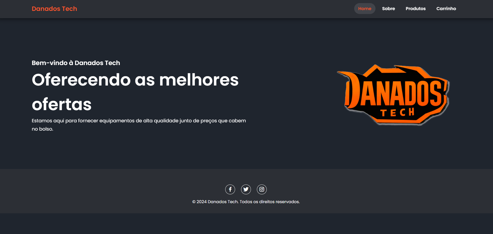
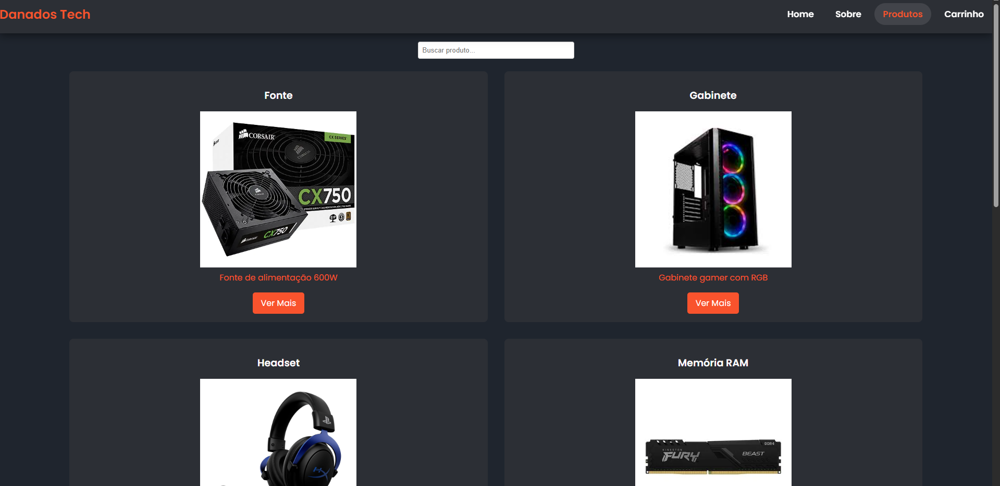

#  🕹️ Danados Tech - Loja Gamer
Danados Tech é uma loja virtual voltada para o público gamer, com um visual moderno e responsivo. O projeto foi desenvolvido como parte de um estudo prático de desenvolvimento web utilizando HTML, CSS e JavaScript.

## 🚀 Tecnologias Utilizadas
- HTML5: estrutura da página.

- CSS3: estilização, responsividade e animações.

- JavaScript: interatividade, funcionalidades dinâmicas e manipulação do DOM.

## 🎮 Funcionalidades
Página inicial com destaque de produtos em promoção.

Lista de produtos com imagens, preços e descrições.

Filtro e busca de produtos (simulado com JavaScript).

Carrinho de compras (simulação local).

Design responsivo para dispositivos móveis.

## 📸 Capturas de Tela

## 📌 Objetivo
Este projeto tem como finalidade aplicar conhecimentos de desenvolvimento web na criação de um e-commerce fictício, simulando funcionalidades básicas e focando em uma boa experiência de usuário.

